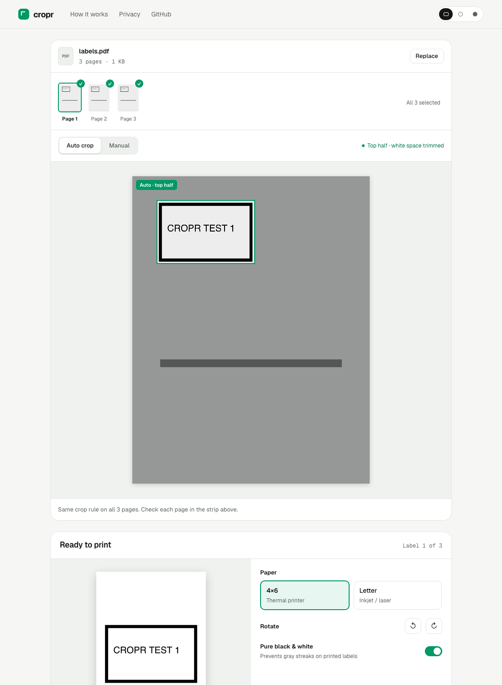

# Cropr – Shipping Label Cropper

A tiny, client-side web app that lets you:

- **Upload** any PDF shipping label
- **Auto-crop** the top 50 % or draw a custom crop rectangle (mouse, touch or keyboard)
- **Preview** the result at 300 dpi with a dashed cut-guide
- **Download** a US Letter-sized PNG for printable shipping labels
- **Print** directly from the browser (single sheet, no headers/footers)

Everything is done locally in your browser; the PDF never leaves your
machine.

---

## Screenshot



---

## Features

| Feature                 | Details                                                                                                                                             |
| ----------------------- | --------------------------------------------------------------------------------------------------------------------------------------------------- |
| **Client-only**         | No back-end, no file upload. Installable, and works offline after the first visit (service worker).                                                 |
| **High-resolution**     | Renders the PDF at 300 dpi, preserving barcode clarity.                                                                                             |
| **Auto vs Manual crop** | One-click top-half crop for FedEx labels, or drag/resize a rectangle to crop. Keyboard: arrow keys move, Shift + arrow keys resize, Enter confirms. |
| **Letter layout**       | Cropped label is centered horizontally and pinned to the top half of an 8.5″ × 11″ page. Portrait labels turn 90°.                                  |
| **Pure black & white**  | On by default. Writes a 1-bit PNG, so no gray haze, and no streaks from browser canvas noise (Safari, Brave, Firefox fingerprinting protection).    |
| **Download / Print**    | Instant PNG download; printing uses a hidden frame so the current tab never reloads.                                                                |
| **Strict security**     | All code is served from the app's own origin. A strict Content-Security-Policy and other security headers are set in `vercel.json`.                 |

---

## Tech stack

- **Vite** – dev server and production build
- **PDF.js** (`pdfjs-dist`) – renders each page at high DPI, in a web worker
- **Tailwind CSS 4** – utility-first styling, compiled at build time
- **Plain JavaScript** – ES modules with JSDoc types (checked by TypeScript), no framework
- **vite-plugin-pwa** – service worker for offline use
- **Vitest** (unit) and **Playwright** (Chromium, Firefox, WebKit) for tests

---

## Getting started

Requires Node.js 22 or later (see `.nvmrc`).

```bash
git clone https://github.com/tatujan/Cropr.git
cd Cropr
npm install
npm run dev        # http://localhost:5173
```

| Command            | What it does                                             |
| ------------------ | -------------------------------------------------------- |
| `npm run dev`      | Dev server with hot reload                               |
| `npm run build`    | Production build in `dist/`                              |
| `npm run preview`  | Serve `dist/` with the production security headers       |
| `npm run check`    | Lint, format check, type check and unit tests (as in CI) |
| `npm test`         | Unit tests (Vitest)                                      |
| `npm run test:e2e` | Browser tests (Playwright) against the production build  |
| `npm run format`   | Format all files with Prettier                           |

Run one unit test file with `npx vitest run test/unit/png.test.js`, or one browser test with
`npx playwright test -g "keyboard" --project=chromium`. Before the first browser test run,
install the browsers with `npx playwright install`.

## Deployment

Vercel builds the app with `npm run build` and serves `dist/`. `vercel.json` sets the security
headers. GitHub Actions (`.github/workflows/ci.yml`) runs all checks and the browser tests on each
push and pull request.
