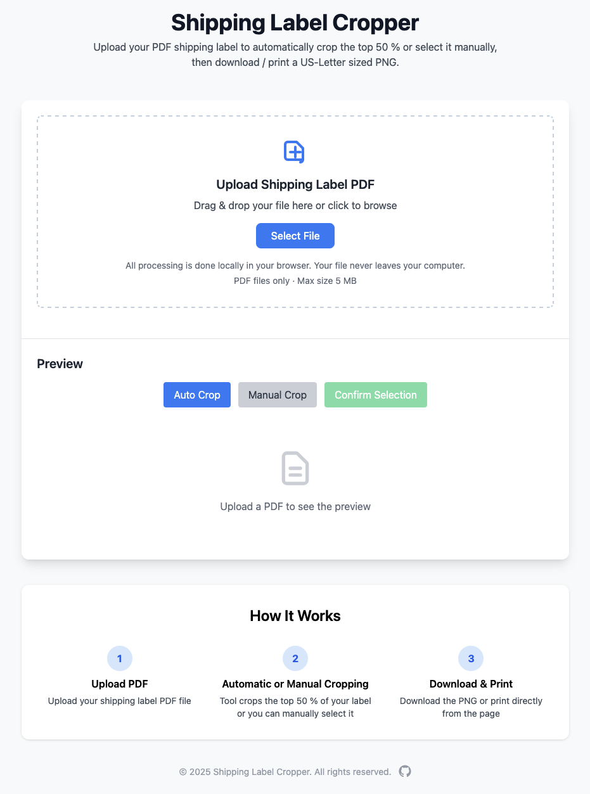

# Shipping Label Cropper

A tiny, client-side web app that lets you:

* **Upload** any PDF shipping label  
* **Auto-crop** the top 50 % or draw a custom crop rectangle  
* **Preview** the result at 300 dpi with a dashed cut-guide  
* **Download** a US Letter-sized PNG for printable shiping labels
* **Print** directly from the browser (single sheet, no headers/footers)

Everything is done locally in your browser; the PDF never leaves your
machine.

---

## Screenshot



---

## Features

| Feature | Details |
|---------|---------|
| **Client-only** | No back-end, no file upload, works offline after first load. |
| **High-resolution** | Renders the PDF at 300 dpi, preserving barcode clarity. |
| **Auto vs Manual crop** | One-click top-half crop for FedEx labels, or drag/resize a rectangle to crop. |
| **Letter layout** | Cropped label is centered horizontally and pinned to the top half of an 8.5″ × 11″ canvas. |
| **Download / Print** | Instant PNG download; printing uses a hidden iframe so the current tab never reloads. |
| **Zero dependencies (besides libs)** | Vanilla JS, Tailwind CSS, PDF.js. No build step required. |

---

## Tech stack

* **Tailwind CSS** – utility-first styling  
* **PDF.js** – renders the first page at high DPI  
* **Plain JavaScript** – no framework, only ~300 LOC  
* **HTML5 Canvas** – cropping and PNG generation

---

## Getting Started

```bash
git clone https://github.com/your-org/shipping-label-cropper.git
cd shipping-label-cropper
# no build step – just open index.html or label-cropper.js files to start
